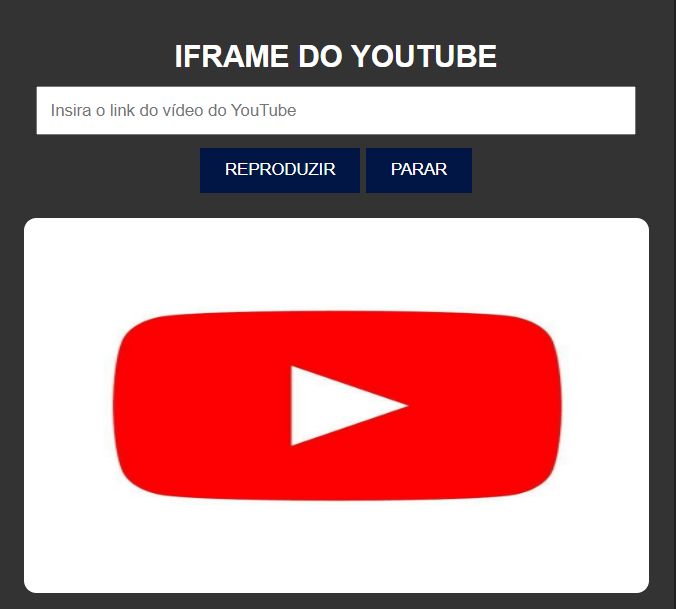
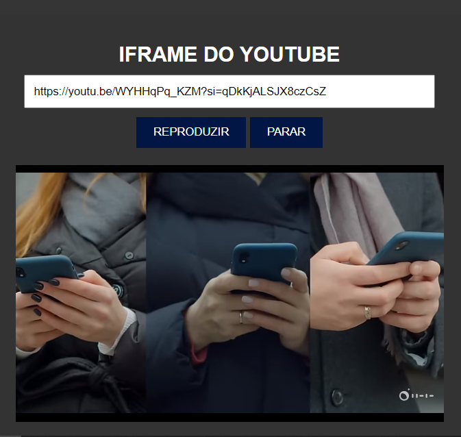

# IFRAME DO YOUTUBE VOLUME 2
🎬ASSISTA SEUS VIDEOS FAVORITOS DO YOUTUBE ATRAVÉS DO IFRAME!

   
  

## DESCRIÇÃO:
Este aplicativo é um reprodutor de vídeos do YouTube integrado a um formulário HTML. Ele permite que os usuários insiram um link de vídeo do YouTube e reproduzam o vídeo diretamente na página. Aqui está uma descrição detalhada dos recursos:

1. **Inserir Link do Vídeo:** Há um campo de texto onde os usuários podem inserir o link do vídeo do YouTube.
2. **Reproduzir Vídeo:** Um botão "REPRODUZIR" permite iniciar a reprodução do vídeo após inserir o link correto.
3. **Parar Reprodução:** Um botão "PARAR" permite interromper a reprodução do vídeo e limpar o campo de entrada.
4. **Exibição do Vídeo:** Uma vez inserido o link do vídeo e clicado em "REPRODUZIR", o vídeo é incorporado à página HTML.
5. **Feedback de Erro:** Se o usuário tentar reproduzir ou parar sem inserir um link válido, ele receberá um alerta indicando que é necessário inserir um link do YouTube primeiro.

## EXECUTANDO O PROJETO:
1. **Inserir Link do Vídeo:** Digite ou cole o link do vídeo do YouTube no campo de texto.
2. **Reproduzir Vídeo:** Clique no botão "REPRODUZIR" para iniciar a reprodução do vídeo.
3. **Parar Reprodução:** Se desejar parar a reprodução do vídeo, clique no botão "PARAR".
4. **Feedback de Erro:** Se você tentar reproduzir ou parar sem inserir um link válido, um alerta será exibido pedindo para inserir um link do YouTube.

## NÃO SABE?
- Entendemos que para manipular arquivos em `HTML`, `CSS` e outras linguagens relacionadas, é necessário possuir conhecimento nessas áreas. Para auxiliar nesse aprendizado, oferecemos cursos gratuitos disponíveis:
* [CURSO DE HTML E CSS](https://github.com/VILHALVA/CURSO-DE-HTML-E-CSS)
* [CURSO DE JAVASCRIPT](https://github.com/VILHALVA/CURSO-DE-JAVASCRIPT)
* [CONFIRA MAIS CURSOS](https://github.com/VILHALVA?tab=repositories&q=+topic:CURSO)

## CREDITOS:
- [PROJETO CRIADO PELO VILHALVA](https://github.com/VILHALVA)
- [ESTÁ DISPONIVEL NO SITE](https://vilhalva.github.io/STYLER/STYLER.html)